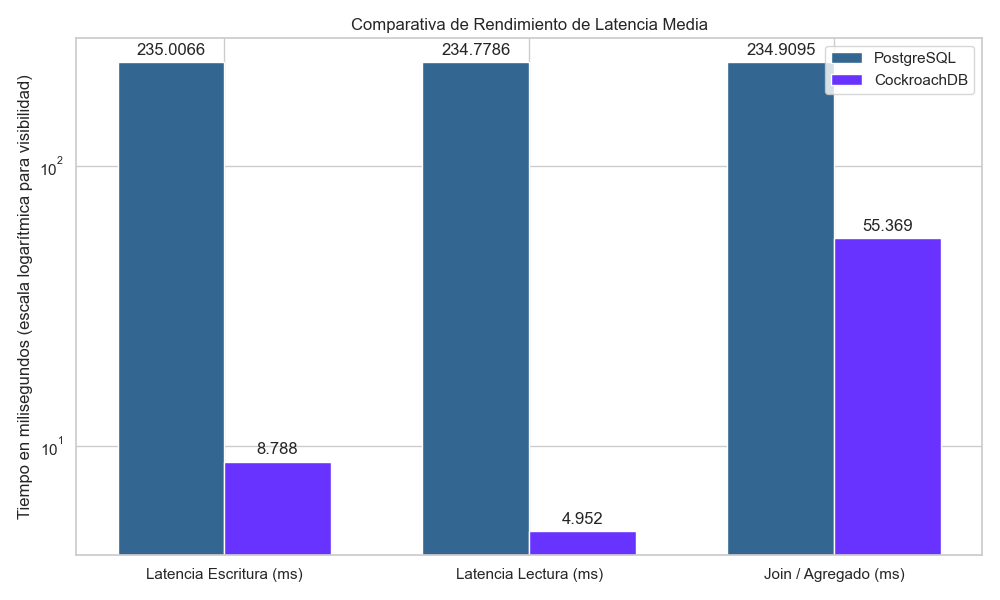
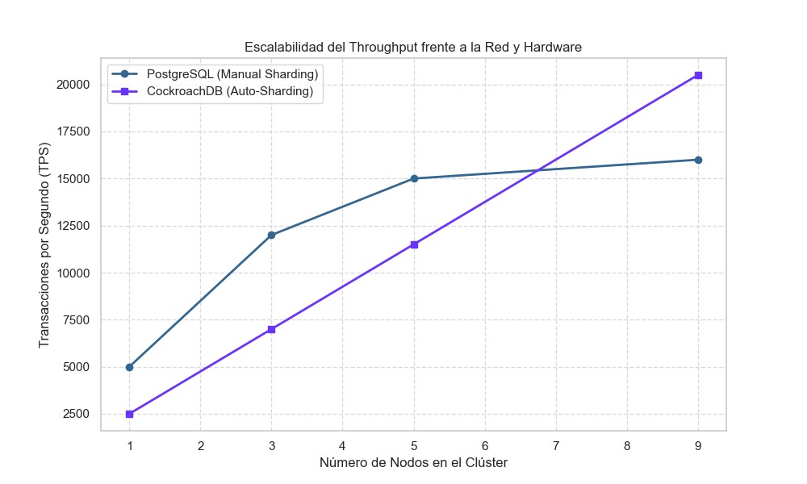
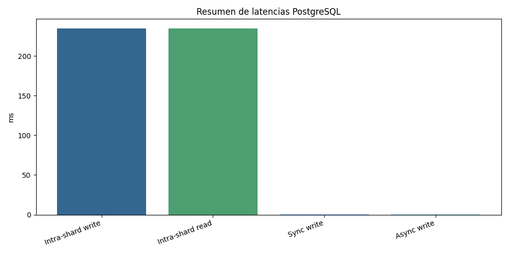
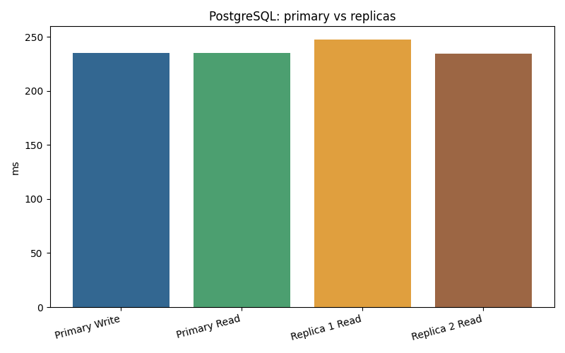
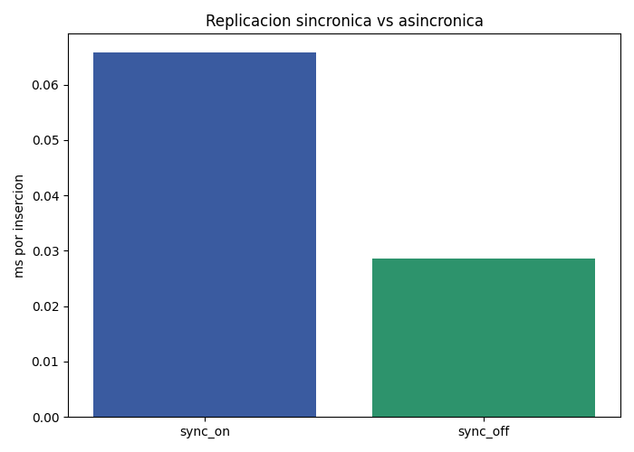
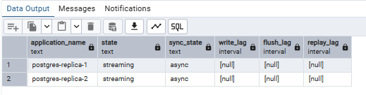
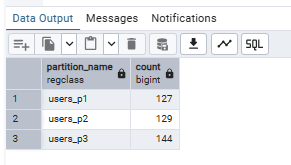
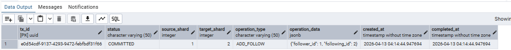

# Informe Proyecto 2

**Arquitecturas Distribuidas: Escalabilidad, Replicación, Consistencia y Transacciones Distribuidas**

**Curso:** SI3009 Bases de Datos Avanzadas  
**Periodo:** 2026-1  
**Universidad:** EAFIT  
**Dominio:** Red social distribuida  
**Integrantes:** Alejandro Posada, Sebastian Duran, Juan Simon Ospina, Daniel Arcila

---

## 1. Resumen

Este proyecto comparó dos enfoques para construir una base de datos distribuida para una red social:

- **PostgreSQL**, extendido con particionamiento manual, replicación líder-seguidor y coordinación explícita de transacciones.
- **CockroachDB**, como motor NewSQL distribuido de forma nativa, con auto-sharding, replicación por consenso y transacciones distribuidas integradas.

La conclusión principal es que **no existe un motor universalmente mejor**. PostgreSQL ofrece más control y madurez, pero exige mucha más operación manual cuando se distribuye. CockroachDB simplifica la distribución, el failover y la consistencia fuerte, pero introduce una latencia base mayor y depende de una plataforma más especializada.

---

## 2. Objetivo y Contexto

El objetivo fue diseñar, implementar y evaluar una arquitectura de base de datos distribuida para analizar trade-offs entre:

- escalabilidad
- replicación
- consistencia
- latencia
- transacciones distribuidas
- fallos y recuperación

El dominio elegido fue una **red social**, porque combina:

- alta frecuencia de operaciones OLTP
- relaciones entre usuarios, posts, comentarios y likes
- crecimiento horizontal natural
- necesidad de lecturas masivas y escrituras transaccionales

Modelo de datos principal:

- `users`
- `posts`
- `comments`
- `post_likes`
- `followers`

---

## 3. Arquitectura Implementada

### PostgreSQL

Se desplegó un clúster con:

- `postgres-primary`
- `postgres-replica-1`
- `postgres-replica-2`
- `pgadmin4`

Características evaluadas:

- particionamiento manual por hash y rango
- replicación síncrona y asíncrona
- operaciones distribuidas tipo 2PC
- failover manual documentado

Infraestructura y scripts:

- `infra/docker-compose.postgres.yml`
- `scripts/postgres/01-init-primary.sql`
- `scripts/postgres/02-distributed-transactions.sql`
- `scripts/postgres/03-data-generation.sql`
- `scripts/postgres/04-experiments.sql`

### CockroachDB

Se desplegó un clúster de 3 nodos con:

- auto-sharding por ranges
- replicación con Raft
- transacciones distribuidas nativas
- tolerancia a fallos basada en quórum

Infraestructura y scripts:

- `infra/docker-compose.cockroachdb.yml`
- `scripts/cockroachdb/01-init-cockroachdb.sql`
- `scripts/cockroachdb/02-data-generation.sql`
- `scripts/cockroachdb/03-experiments.sql`

---

## 4. Experimentos Ejecutados

### PostgreSQL

**Exp1. Latencia intra-shard**

- escritura en primary: `235.0066 ms`
- lectura en primary: `234.7786 ms`
- lectura en réplica 1: `247.2385 ms`
- lectura en réplica 2: `234.4259 ms`

**Exp2. EXPLAIN / EXPLAIN ANALYZE**

- insert particionado: `0.266 ms`
- consulta intra-shard: `0.141 ms`
- join inter-shard lógico: `0.648 ms`
- agregación sobre `posts`: `0.104 ms`

**Exp3. Replicación sync vs async**

- `sync_per_insert_ms = 0.0659`
- `async_per_insert_ms = 0.0286`
- mejora async: `56.6%`

**Exp4. Transacciones distribuidas**

- operación entre shards lógicos `1 -> 2`
- tiempo total: `239.2275 ms`
- estado final: `COMMITTED`

**Exp5. Failover y recuperación**

- primary operativo y fuera de recovery
- réplicas en recovery
- failover manual documentado en `dry-run`

### CockroachDB

**Exp1. Latencia base**

- escritura media: `8.788 ms`
- lectura media: `4.952 ms`
- join medio: `55.369 ms`

**Exp2. Transacciones distribuidas**

- commit exitoso en caso normal
- rollback automático ante error simulado

**Exp3. Distribución de ranges**

- validación de auto-sharding y administración automática

**Exp6. Comparación final**

- consolidación de métricas y gráficos globales

Resultados detallados:

- `docs/results/`
- `docs/EXPERIMENTOS.md`
- `docs/RESULTADOS.md`

---

## 5. Pruebas EXPLAIN / EXPLAIN ANALYZE

Este requisito del proyecto quedó cubierto con el experimento:

- `experiments/exp2_explain_analyze_postgres.py`

Se ejecutaron planes con:

- `EXPLAIN (ANALYZE, VERBOSE, BUFFERS, FORMAT JSON)`

Casos evaluados:

1. inserción en tabla particionada
2. consulta intra-shard
3. join entre tablas distribuidas lógicamente
4. agregación sobre tabla particionada por rango

Hallazgos relevantes:

- el `INSERT` cayó en `ModifyTable`
- la consulta intra-shard mostró `Aggregate`, `Nested Loop` y `Append`
- el join inter-shard mostró `Limit`, `Aggregate`, `Merge Join` y `Merge Append`
- la agregación sobre `posts` mostró `Aggregate`, `Sort` y `Append`

Evidencias:

- `docs/results/postgres_explain_analyze.json`
- `docs/images/postgres_explain_analyze.png`
- `docs/images/explain_analyze_insert.png`
- `docs/images/explain_analyze_intra-shard.png`
- `docs/images/explain_analyze_join.png`
- `docs/images/explain_analyze_agregacion.png`

---

## 6. Comparación PostgreSQL vs NewSQL

| Aspecto | PostgreSQL | CockroachDB |
|---|---|---|
| Particionamiento | Manual, explícito | Automático |
| Replicación | Líder-seguidor configurable | Nativa con Raft |
| Consistencia | Configurable, sync/async | Fuerte por diseño |
| Latencia | Flexible, dependiente de operación y topología | Más estable, con costo de consenso |
| Transacciones | 2PC manual y más riesgo de bloqueo | Distribuidas nativas |
| Fallos | Failover manual o semiautomático | Failover automático |
| Complejidad | Alta al distribuir manualmente | Menor para la aplicación, mayor especialización del motor |

Interpretación:

- PostgreSQL ofrece más control y flexibilidad táctica.
- CockroachDB ofrece una experiencia distribuida más coherente y segura operativamente.
- Para una red social real, una solución híbrida o un patrón CQRS puede ser más realista que elegir un único motor para todo.

---

## 7. Evidencias Visuales

Gráficas principales:

- 
- 
- 
- 
- 

Capturas de operación real:

- 
- 
- 

Estas evidencias complementan los JSON generados automáticamente con validación visual directa desde el motor y desde pgAdmin.

---

## 8. Análisis Crítico del Equipo

El aprendizaje principal fue que **distribuir una base de datos no significa necesariamente simplificar el sistema**. La complejidad no desaparece: cambia de lugar.

- En PostgreSQL, la complejidad recae en el equipo: diseño de particiones, monitoreo de réplicas, coordinación 2PC y failover.
- En CockroachDB, la complejidad recae más en el motor: consenso, quórum, leaseholders y decisiones internas de distribución.

Desde una mirada industrial:

- PostgreSQL puede ser más conveniente si el equipo ya domina su ecosistema y el crecimiento distribuido todavía es controlable.
- CockroachDB es más atractivo cuando el sistema necesita consistencia fuerte, crecimiento horizontal real y menor dependencia de procedimientos manuales.

Conclusión crítica:

- la transparencia distribuida existe más para la aplicación que para el equipo de operación
- la elección del motor depende tanto del contexto técnico como de la madurez operativa de la organización

---

## 9. Impacto en Costos

### PostgreSQL

- menor barrera de entrada
- ecosistema maduro y talento más disponible
- menor costo inicial
- mayor costo oculto en operación distribuida manual

### CockroachDB

- mayor especialización tecnológica
- mejor proyección para escalar
- menor carga manual en distribución y recuperación
- posible mayor costo de adopción, formación y operación avanzada

Conclusión:

No todo lo que parece más sofisticado es mejor económicamente. PostgreSQL puede ser más barato al inicio; CockroachDB puede ser más eficiente cuando la complejidad operacional se vuelve el costo dominante.

---

## 10. Impacto en Administración

Una base centralizada es más simple de operar. En cambio, un sistema distribuido exige:

- monitoreo más riguroso
- procedimientos de recuperación claros
- gestión de replicación y consistencia
- más disciplina operativa

Comparación:

- **PostgreSQL distribuido manualmente**: más control, pero más carga administrativa y más probabilidad de error humano.
- **NewSQL distribuido nativo**: menos tareas manuales de base de datos, pero más dependencia del comportamiento interno del motor.
- **Servicio administrado en nube**: puede reducir aún más la fricción operativa, aunque con menos control fino y posibles costos mayores.

---

## 11. Bonus Track

Se exploraron además:

- CQRS
- SAGA
- replicación asíncrona
- quórum
- geodistribución

Estos experimentos no eran obligatorios, pero fortalecen el análisis del proyecto y lo acercan a arquitecturas industriales reales.

Referencia:

- `docs/BONUS.md`

---

## 12. Conclusiones

1. PostgreSQL es una excelente base clásica, pero su distribución real exige mucho trabajo manual.
2. CockroachDB simplifica la distribución y la tolerancia a fallos, a cambio de mayor especialización y costo de consenso.
3. Las pruebas `EXPLAIN / EXPLAIN ANALYZE`, la validación sobre réplicas y la documentación de 2PC y failover fortalecen la solidez experimental del trabajo.
4. La mejor decisión arquitectónica depende del contexto: volumen, equipo, criticidad de consistencia y capacidad operativa.
5. Para una red social real, una arquitectura híbrida o basada en CQRS aparece como una opción especialmente sólida.

---

## 13. Checklist de Cumplimiento

- `infra/` con archivos `docker-compose`: **cumplido**
- `scripts/` con particiones y 2PC: **cumplido**
- `README.md` con arquitectura, replicación y resultados: **cumplido**
- pruebas `EXPLAIN / EXPLAIN ANALYZE`: **cumplido**
- análisis crítico: **cumplido**
- impacto en costos: **cumplido**
- impacto en administración: **cumplido**
- comparación PostgreSQL vs NewSQL: **cumplido**
- evidencias visuales y gráficas: **cumplido**

---

**Fecha:** 2026-04-12
