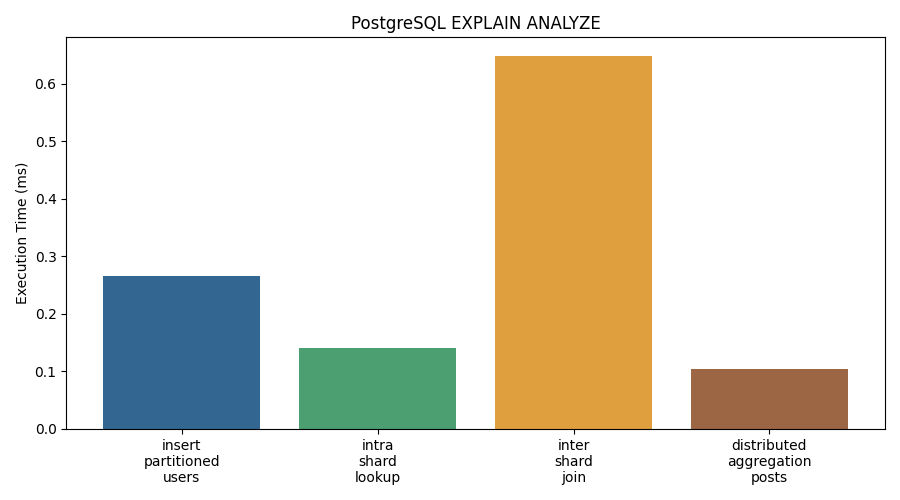

# Proyecto 2: Arquitecturas Distribuidas - Red Social

**Bases de Datos Avanzadas - SI3009 (2026-1)**  
**Ingeniería de Sistemas - Universidad EAFIT**

Integrantes:

- Alejandro Posada
- Sebastian Duran
- Juan Simon Ospina
- Daniel Arcila

---

## Índice

- [Descripción General](#descripción-general)
- [Contexto del Problema](#contexto-del-problema)
- [Arquitectura](#arquitectura)
- [Requerimientos](#requerimientos)
- [Estructura del Proyecto](#estructura-del-proyecto)
- [Instalación y Configuración](#instalación-y-configuración)
- [Ejecución de Experimentos](#ejecución-de-experimentos)
- [Resultados y Análisis](#resultados-y-análisis)
- [Análisis Crítico](#análisis-crítico)
- [Impacto en Costos](#impacto-en-costos)
- [Impacto en Administración](#impacto-en-administración)
- [Equipo](#equipo)

---

## Descripción General

Este proyecto implementa una arquitectura de base de datos distribuida para una **red social**, comparando:

1. **PostgreSQL**
   - Particionamiento horizontal manual por hash y rango
   - Replicación líder-seguidor
   - Transacciones distribuidas con 2PC manual
   - 3 nodos: 1 primary y 2 réplicas

2. **CockroachDB**
   - Auto-sharding nativo
   - Replicación con Raft
   - Transacciones ACID distribuidas nativas
   - 3 nodos con consenso automático

Entidades principales:

- `users`
- `posts`
- `comments`
- `post_likes`
- `followers`

Informe completo de entrega:

- [Informe_proyecto_2.md](Informe_proyecto_2.md)

---

## Contexto del Problema

En un sistema centralizado, mantener propiedades ACID es más simple. Al distribuir datos aparecen retos como:

- joins entre particiones
- transacciones multi-nodo
- trade-offs entre consistencia y disponibilidad
- particiones de red
- complejidad de replicación y failover

Este proyecto responde preguntas como:

1. ¿Cómo particionar datos transparentemente en PostgreSQL?
2. ¿Cuál es el costo de performance de las transacciones distribuidas?
3. ¿Cómo maneja CockroachDB la distribución de forma nativa?
4. ¿Cuáles son los trade-offs CAP y PACELC en la práctica?

---

## Arquitectura

### Diagrama de Componentes

```text
┌─────────────────────────────────────────────────────────────┐
│                  APLICACIÓN (Python)                       │
│            Conexiones, medición y experimentos             │
└──────────────────────┬──────────────────────────────────────┘
                       │
            ┌──────────┴──────────┐
            │                     │
      ┌─────▼─────┐         ┌─────▼─────┐
      │ PostgreSQL │         │ Cockroach │
      │  3 nodos   │         │  3 nodos  │
      └─────┬─────┘         └─────┬─────┘
            │                     │
      ┌─────▼─────────────────────▼─────┐
      │      Docker Compose + Red       │
      │  Simulación de latencia/fallos  │
      └─────────────────────────────────┘
```

### Estrategia de Sharding en PostgreSQL

**Tabla `users`**

- hash sobre `user_id`
- `Shard = user_id % 3`

**Tabla `posts`**

- particionamiento por rango usando `created_at`

**Tabla `followers`**

- hash sobre `follower_id`

Documentación ampliada:

- [docs/ARQUITECTURA.md](docs/ARQUITECTURA.md)

---

## Requerimientos

### Técnicos

- Docker y Docker Compose
- PostgreSQL 15+
- CockroachDB 23.2+
- Python 3.9+
- `psycopg2`
- `python-dotenv`

### Hardware recomendado

- Máquina local: 4 CPU / 8 GB RAM mínimo
- Infraestructura usada por el equipo: AWS EC2

Instalación de dependencias:

```bash
pip install -r requirements.txt
```

---

## Estructura del Proyecto

```text
infra/         docker-compose y topologías
scripts/       SQL de inicialización, particiones, 2PC, datos y monitoreo
experiments/   scripts de experimentación y análisis
docs/          arquitectura, resultados, bonus, CAP/PACELC y presentación
docs/results/  resultados JSON
docs/images/   gráficas y capturas de evidencia
```

---

## Instalación y Configuración

### 1. Clonar el repositorio

```bash
git clone <URL_REPOSITORIO>
cd Proyecto2-bd-avanzadas
```

### 2. Iniciar PostgreSQL

```bash
docker compose -f infra/docker-compose.postgres.yml up -d
docker ps
```

### 3. Inicializar PostgreSQL

```bash
psql -h localhost -U admin -d social_network -f scripts/postgres/01-init-primary.sql
psql -h localhost -U admin -d social_network -f scripts/postgres/03-data-generation.sql
```

### 4. Iniciar CockroachDB

```bash
docker compose -f infra/docker-compose.cockroachdb.yml up -d
docker exec -it cockroach-node1 ./cockroach node status --insecure --host=localhost:26257
```

### 5. Bonus

```bash
docker compose -f infra/docker-compose.bonus-cqrs.yml up -d
python experiments/bonus_cqrs_demo.py
python experiments/bonus_async_replication_postgres.py
python experiments/bonus_saga_postgres.py
```

Detalles completos:

- [docs/BONUS.md](docs/BONUS.md)

---

## Ejecución de Experimentos

### CockroachDB - Experimento 1: Latencia Base

```bash
python experiments/exp1_latency_crdb.py
```

Resultado observado:

- write mean: `8.788 ms`
- read mean: `4.952 ms`

### CockroachDB - Experimento 2: Transacciones Distribuidas ACID

```bash
python experiments/exp2_transactions_crdb.py
```

Resultado observado:

- caso exitoso con commit
- caso con error simulado y rollback automático

### CockroachDB - Experimento 3: Distribución de Rangos

```bash
python experiments/exp3_ranges_distribution.py
```

### PostgreSQL - Experimento 1: Latencia Intra-Shard

```bash
python experiments/exp1_latency_intra_shard.py
```

Resultado observado:

- write primary mean: `235.0066 ms`
- read primary mean: `234.7786 ms`
- read replica1 mean: `247.2385 ms`
- read replica2 mean: `234.4259 ms`

### PostgreSQL - Experimento 2: EXPLAIN / EXPLAIN ANALYZE

```bash
python experiments/exp2_explain_analyze_postgres.py
```

Resultado observado:

- insert particionado: `0.266 ms`
- intra-shard lookup: `0.141 ms`
- inter-shard join lógico: `0.648 ms`
- agregación sobre `posts`: `0.104 ms`

### PostgreSQL - Experimento 3: Replicación Sync vs Async

```bash
python experiments/exp3_replication_sync.py
```

Resultado observado:

- sync per insert: `0.0659 ms`
- async per insert: `0.0286 ms`
- mejora async: `56.6%`

### PostgreSQL - Experimento 4: Transacciones Distribuidas

```bash
python experiments/exp4_distributed_transactions.py
```

Resultado observado:

- operación entre shards lógicos `1 -> 2`
- estado final: `COMMITTED`
- tiempo total: `239.2275 ms`

### PostgreSQL - Experimento 5: Failover y Recuperación

```bash
python experiments/exp5_failover_recovery.py
```

Resultado observado:

- primary fuera de recovery
- réplicas en recovery
- failover documentado en `dry-run`

### Experimento 6: Comparación PostgreSQL vs CockroachDB

```bash
python experiments/exp6_comparison.py
```

Exporta:

- `docs/images/latency_comparison.png`
- `docs/images/throughput_scalability.png`
- `docs/results/exp6_comparison.json`

Registro detallado:

- [docs/EXPERIMENTOS.md](docs/EXPERIMENTOS.md)

---

## Resultados y Análisis

### Métricas Principales

| Métrica | PostgreSQL | CockroachDB | Observación |
|---|---:|---:|---|
| Latencia write base (ms) | 235.0066 | 8.788 | PostgreSQL pagó mayor RTT hacia AWS |
| Latencia read base (ms) | 234.7786 | 4.952 | CockroachDB mostró menor latencia base en la corrida actual |
| Lectura en réplica (ms) | 247.2385 / 234.4259 | N/A | PostgreSQL validó lectura real en ambas réplicas |
| Sync vs Async (ms/insert) | 0.0659 / 0.0286 | N/A | Async mejoró 56.6% |
| Transacción distribuida (ms) | 239.2275 | Nativo | PostgreSQL requiere coordinación manual |
| Failover | Manual | Automático | CockroachDB ofrece mejor recuperación por diseño |

### Gráficos de Resultados





### Evidencias Manuales

Además de los resultados automáticos, se tomaron capturas manuales en pgAdmin y del estado del clúster:

- `docs/images/pg_stat_replication.png`
- `docs/images/Distribucio_por_particiones.png`
- `docs/images/distributed_transactions.png`
- `docs/images/explain_analyze_insert.png`
- `docs/images/explain_analyze_intra-shard.png`
- `docs/images/explain_analyze_join.png`
- `docs/images/explain_analyze_agregacion.png`

### Artefactos

- `docs/results/exp1_latency_intra_shard.json`
- `docs/results/postgres_explain_analyze.json`
- `docs/results/exp3_replication_sync.json`
- `docs/results/exp4_distributed_transactions.json`
- `docs/results/exp5_failover_recovery.json`
- `docs/results/postgres_summary.json`
- `docs/results/exp6_comparison.json`

Documentos complementarios:

- [docs/RESULTADOS.md](docs/RESULTADOS.md)
- [docs/CAP_PACELC_ANALYSIS.md](docs/CAP_PACELC_ANALYSIS.md)
- [docs/RESUMEN_EJECUTIVO.md](docs/RESUMEN_EJECUTIVO.md)

---

## Análisis Crítico

El proyecto mostró que distribuir una base de datos no vuelve al sistema automáticamente “mejor”. La complejidad solo cambia de lugar:

- en PostgreSQL, recae más sobre el equipo de ingeniería y operación
- en CockroachDB, recae más en el motor y en su modelo distribuido interno

Conclusiones del equipo:

- PostgreSQL sigue siendo muy valioso cuando se priorizan madurez, control y compatibilidad.
- CockroachDB es más fuerte cuando la necesidad real es consistencia distribuida, failover automático y menor intervención manual.
- En una red social realista, una arquitectura híbrida o un patrón CQRS puede ser más apropiado que una decisión de “todo en un solo motor”.

Casos y discusión ampliada:

- [Informe_proyecto_2.md](Informe_proyecto_2.md)
- [docs/CAP_PACELC_ANALYSIS.md](docs/CAP_PACELC_ANALYSIS.md)

---

## Impacto en Costos

### PostgreSQL

- menor barrera de entrada
- ecosistema maduro
- talento más disponible
- costo oculto mayor en operación distribuida manual

### CockroachDB

- mayor especialización tecnológica
- mejor proyección de escalado distribuido
- menor esfuerzo manual en recuperación y distribución

Conclusión:

PostgreSQL puede ser más barato al inicio, pero en escenarios distribuidos reales el costo operativo humano puede crecer rápidamente. CockroachDB puede compensar su adopción con menor fricción para escalar y recuperarse.

---

## Impacto en Administración

Comparación operativa:

- **Base centralizada**: menor complejidad de monitoreo, respaldo y recuperación.
- **PostgreSQL distribuido manualmente**: más control, pero más procedimientos, más documentación y más riesgo de error humano.
- **Servicio distribuido nativo o administrado**: menos tareas manuales, más foco en observabilidad y políticas de despliegue.

Conclusión:

Administrar un sistema distribuido no es solo un problema técnico; también es un problema organizacional. La madurez operativa del equipo importa tanto como la tecnología elegida.

---

## Checklist de Entrega

- `infra/` contiene `docker-compose` para PostgreSQL, CockroachDB, latencia y bonus CQRS
- `scripts/` contiene inicialización, particionamiento, 2PC, generación de datos y experimentos
- `README.md` documenta arquitectura, replicación, particionamiento, consistencia, resultados y análisis
- `docs/EXPERIMENTOS.md` registra la ejecución detallada de experimentos
- `docs/RESULTADOS.md` consolida hallazgos técnicos
- `docs/CAP_PACELC_ANALYSIS.md` cubre la comparación CAP/PACELC
- `docs/RESUMEN_EJECUTIVO.md` resume la recomendación final
- `docs/PRESENTACION_FINAL.md` deja listo el guion de exposición
- `docs/results/` contiene resultados persistidos
- `docs/images/` contiene gráficas y evidencias visuales
Trabajo desarrollado de forma colaborativa por el grupo del curso:
- Juan simón Ospina
- Sebastian Duran
- Alejandro Posada
- Daniel Arcila


---

## Equipo

- Alejandro Posada
- Sebastian Duran
- Juan Simon Ospina
- Daniel Arcila

---

## Recursos Adicionales

- PostgreSQL Partitioning: https://www.postgresql.org/docs/current/ddl-partitioning.html
- PostgreSQL 2PC: https://www.postgresql.org/docs/current/sql-prepare-transaction.html
- CockroachDB Docs: https://www.cockroachlabs.com/docs/
- CockroachDB Architecture: https://www.cockroachlabs.com/docs/stable/architecture/overview.html
- CAP Theorem: https://en.wikipedia.org/wiki/CAP_theorem
- PACELC Theorem: https://en.wikipedia.org/wiki/PACELC_theorem

---

**Fecha de entrega:** 2026-04-12 
**Versión:** 1.0
